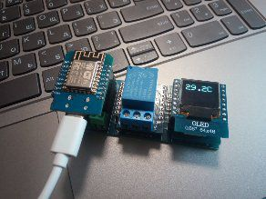

# esp8266-template
Данный проект создан в качестве шаблона для домашней автоматизации на базе esp8266 wemos mini.
Разработан с помощью PlatformIO. 

1. В качестве примера используется экран 64*48 пикселей, датчик DHT22, реле. Ведется лог в Serial c использованием шаблонной функции WRITE_INFO(отключается дефайном #define SERIAL_INFO сменой true на false) и в топик MQTT.

2. Настроечные дефайны вынесены в файл defines.h, не забудь поправить под себя.
3. Реализовано обновление прошивки, для чего необходимо перейти на веб интерфейс устройства и выбрать файл новой прошивки. 
4. Реализовано автоматическое переподключение к Wi-Fi и MQTT в случае утраты связи. Код не блокирующий, если прибору не удастся подключиться, то он все равно продолжит работу.
5. Разработана удобная функция mqttPrintf() для публикации данных по MQTT. Примеры использования смотри в коде.
6. Разработан модуль NTP для синхронизации с сервером времени.

