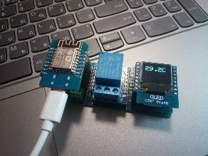

# Шаблон ESP8266 / ESP8266 Template

## Русский

Заготовка прошивки для Wemos D1 mini (ESP8266) на PlatformIO. Она нужна как стартовая точка для устройств с Wi‑Fi, MQTT, OTA и типовыми GPIO-задачами.

### Что уже есть

- Асинхронный MQTT-клиент с автоматическим переподключением и очередью сообщений на время отсутствия брокера.
- Подключение к Wi‑Fi с повторными попытками без блокировки основного цикла.
- NTP-синхронизация времени без ожидания ответа в `loop()`.
- OTA-обновление через HTTP.
- `Timer` для периодических задач с корректной обработкой переполнения `millis()`.
- `RingBuf` — FIFO-буфер произвольных элементов; при заполнении вытесняет самый старый элемент.
- `DebouncedInput` для кнопок: новое состояние принимается после 10 мс стабильного уровня.
- `PulseCounter` для тахометров, расходомеров и других счётчиков импульсов.
- `HardwareTimer` для пользовательского Timer1 ESP8266. Не используйте его одновременно с `analogWrite()`: PWM ядра ESP8266 занимает Timer1.

### Настройка

Все параметры находятся в [`include/defines.h`](include/defines.h): Wi‑Fi, MQTT, пины, интервалы, OTA и MQTT-топики.

В шаблоне включён простой пример GPIO:

- `BUTTON_PIN` — кнопка между D3 и GND, используется `INPUT_PULLUP`;
- `GPIO_OUTPUT_PIN` — выход D4;
- каждое нажатие кнопки переключает выход.

При включении DHT22 или дисплея раскомментируйте их вызовы в [`src/main.cpp`](src/main.cpp) и убедитесь, что выбранные пины не пересекаются с GPIO-примером.

### Сборка

```sh
pio run
```

Прошивка собирается для окружения `d1_mini`, описанного в [`platformio.ini`](platformio.ini).



## English

Firmware starter template for Wemos D1 mini (ESP8266) built with PlatformIO. It is intended as a starting point for devices with Wi‑Fi, MQTT, OTA, and common GPIO tasks.

### Included features

- Asynchronous MQTT client with automatic reconnect and an offline message queue.
- Wi‑Fi connection retries without blocking the main loop.
- NTP synchronization without blocking `loop()` while waiting for a response.
- HTTP OTA firmware updates.
- `Timer` for periodic tasks, safe across `millis()` rollover.
- `RingBuf`, a generic FIFO buffer that replaces the oldest element when full.
- `DebouncedInput` for buttons: a new state is accepted after 10 ms of stability.
- `PulseCounter` for tachometers, flow meters, and other pulse sources.
- `HardwareTimer` wrapper for the ESP8266 user Timer1. Do not use it together with `analogWrite()`: ESP8266 core PWM occupies Timer1.

### Configuration

All settings are in [`include/defines.h`](include/defines.h): Wi‑Fi, MQTT, pins, intervals, OTA, and MQTT topics.

The template enables a simple GPIO example:

- `BUTTON_PIN`: a button between D3 and GND using `INPUT_PULLUP`;
- `GPIO_OUTPUT_PIN`: D4 output;
- every button press toggles the output.

To enable the DHT22 sensor or display, uncomment their calls in [`src/main.cpp`](src/main.cpp) and ensure their pins do not overlap with the GPIO example.

### Build

```sh
pio run
```

The firmware builds for the `d1_mini` environment defined in [`platformio.ini`](platformio.ini).


